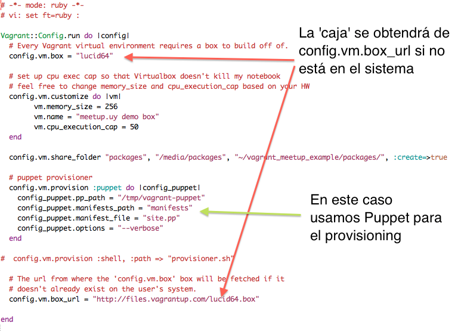
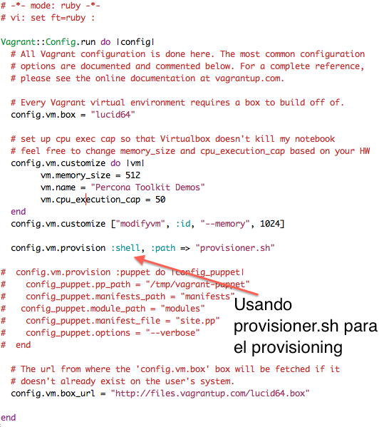
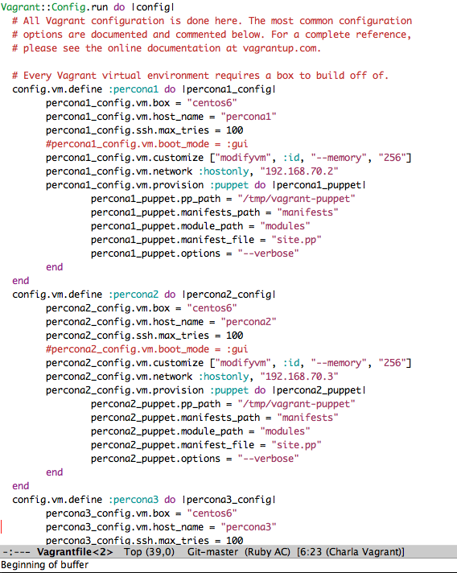

Entornos de prueba en minutos con Vagrant
===

Fernando Ipar, tech meetup - Montevideo, 2012

!

Acerca de ...
===

- Fernando Ipar
- Consultor @ Percona
- fernando.ipar@percona.com

!

Esta presentación
===

- http://github.com/fipar/presentacion_vagrant

!

Vagrant
===

Facilita la construcción y distribución de ambientes virtuales basados
en Oracle VirtualBox

!

http://vagrantup.com
===

!

¿Por qué?
===

!

Mi máquina *no* necesita
libnet-daemon-perl 0.43-1 ...

!

... o necesita una *versión distinta*

!

Quiero que todos los miembros de un proyecto trabajen con el *mismo entorno*

!

o distribuir un entorno de prueba que cualquier usuario pueda *iniciar fácilmente*

!

o asegurarme que el sistema en producción se instalará *exactamente* de
la misma forma que en desarrollo

!

The one slide Vagrant tutorial &copy;
===

!

    $ cd <directorio donde existe Vagrantfile>
    $ vagrant up
	$ vagrant ssh
   
!

Un poco mas de detalle
===

!

Boxes
===

- Son la imagen usada para crear un entorno Virtual con vagrant. 
- http://vagrantbox.es

    $ vagrant box list

!

Vagrantfile
===

- Código Ruby que define la(s) máquina(s) de un proyecto

!

Provisioning
===

- Chef (solo o server)
- Puppet (idem ^^)
- Shell :-)
- Cualquier cosa que herede Vagrant::Provisioners::Base

!

Packaging
===

    $ cd <directorio de mi proyecto (con Vagrantfile)>
	$ vagrant package

!

vagrant package creará un archivo *package.box*. 

Con este archivo y un archivo Vagrantfile, *cualquier* persona con acceso a los mismos
puede ejecutar 'vagrant up' y tener el entorno listo en minutos. 

!

!

!

!

Demo
===

!

¿Preguntas?
===

